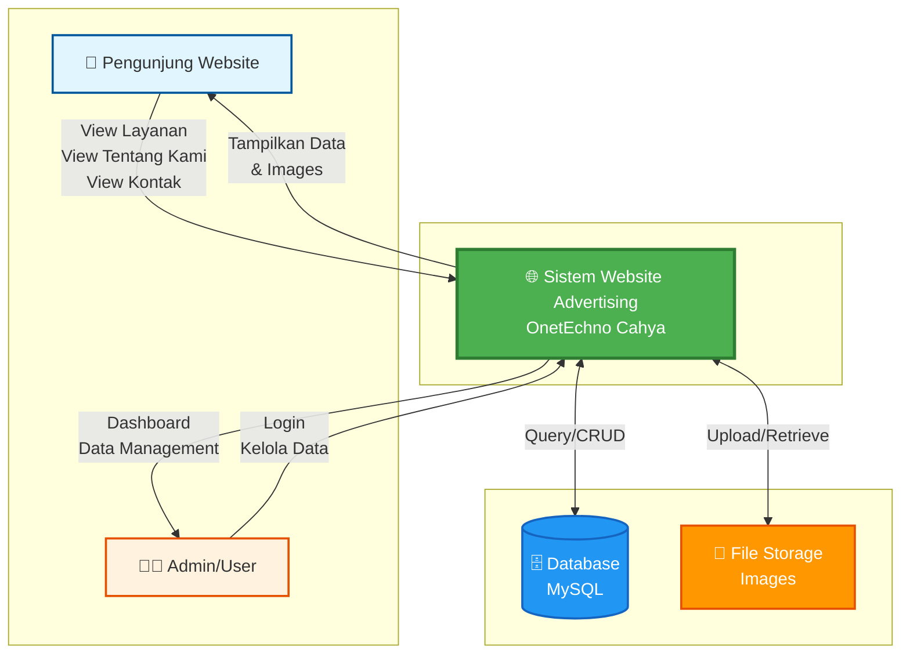
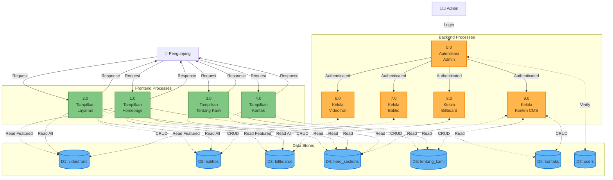
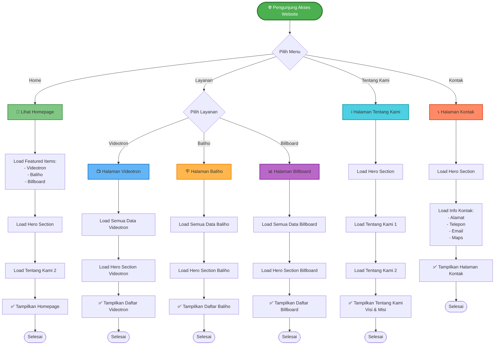
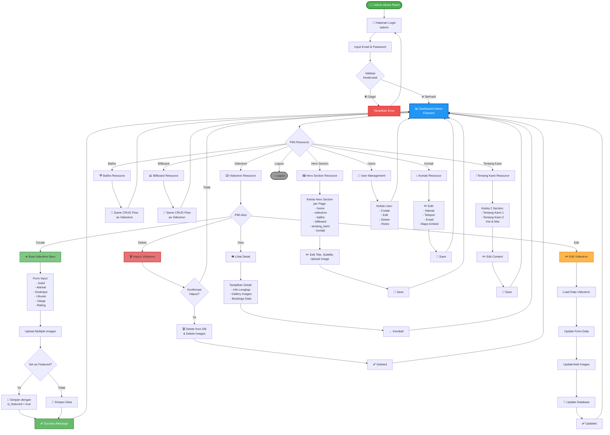
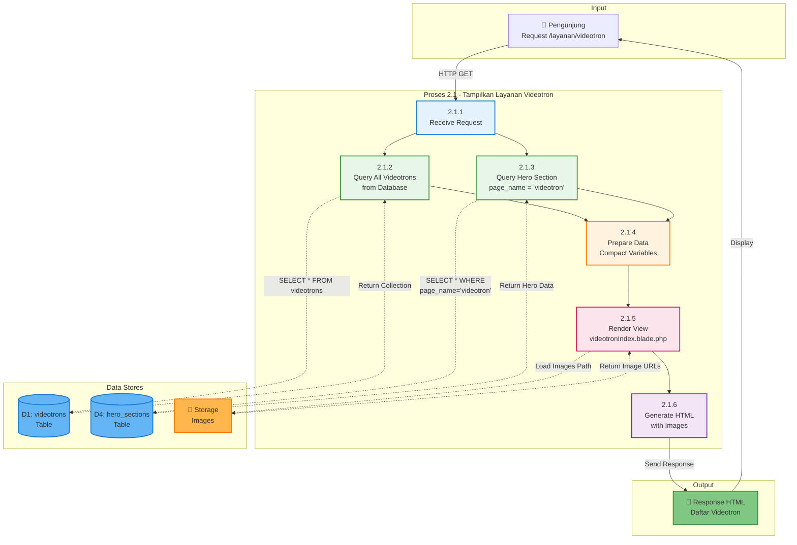
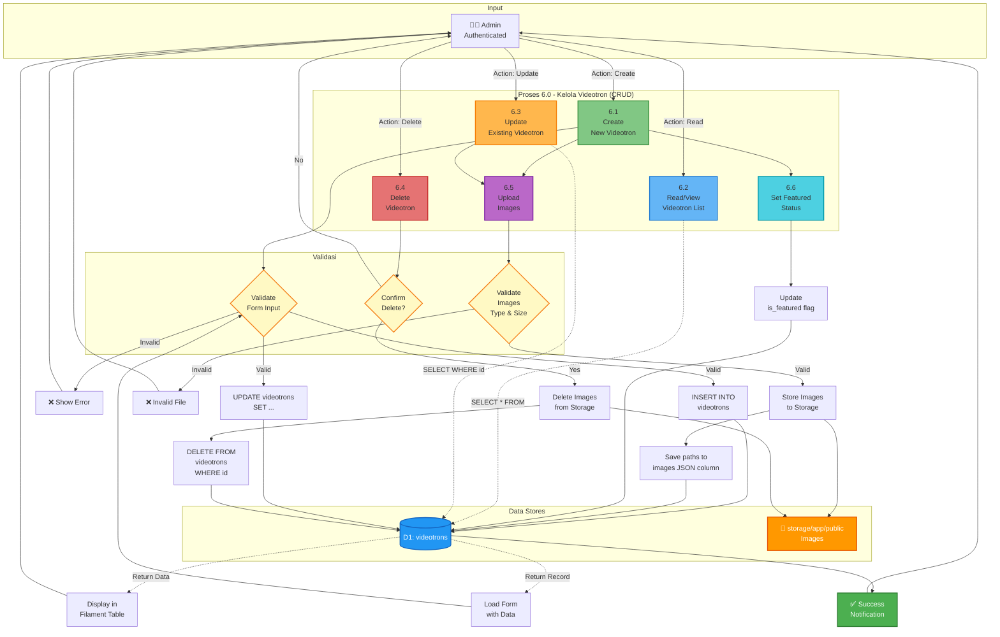
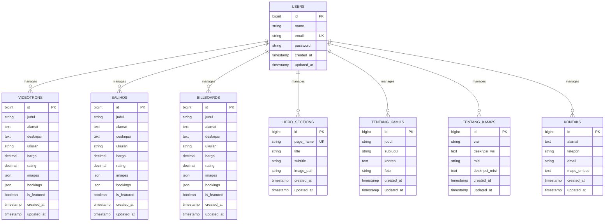
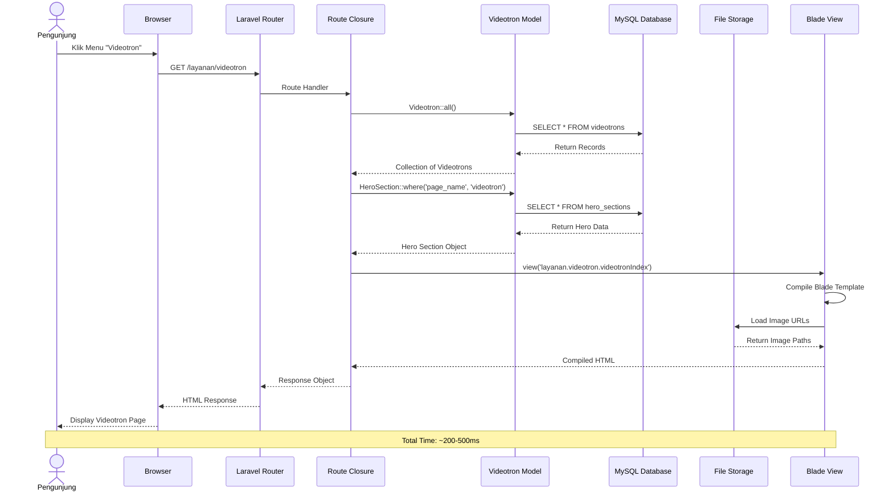
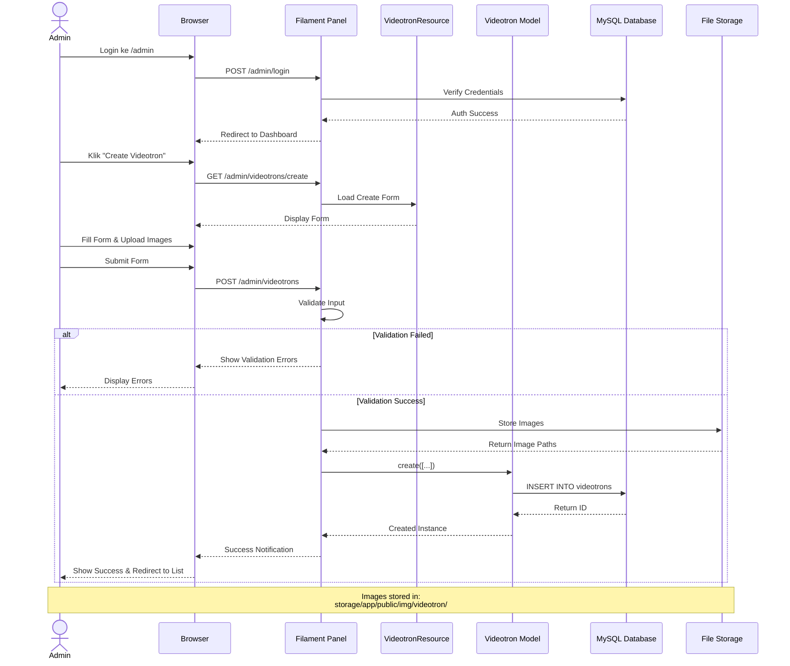

saya # Data Flow Diagram & Flowchart - Website Advertising OnetEchno

## 1. DFD Context Diagram (Level 0)

---

## 2. DFD Level 1 - Proses Utama

---

## 3. Flowchart - Frontend User Journey

---

## 4. Flowchart - Admin Management Flow

---

## 5. DFD Level 2 - Detail Proses Layanan Videotron

---

## 6. DFD Level 2 - Detail Proses CRUD Admin (Videotron)

---

## 7. Entity Relationship Diagram (ERD)

---

## 8. Sequence Diagram - Pengunjung Melihat Layanan

---

## 9. Sequence Diagram - Admin Create Videotron

---

## Keterangan Simbol & Warna

### DFD Symbols:
- 🔵 **Oval/Circle**: External Entity (Pengunjung, Admin)
- 🟢 **Rectangle**: Process (1.0, 2.0, dll)
- 🔷 **Cylinder**: Data Store (Database Tables)
- 📁 **Folder**: File Storage
- →: Data Flow

### Color Coding:
- 🟢 **Hijau**: Frontend Processes
- 🟠 **Oranye**: Backend/Admin Processes
- 🔵 **Biru**: Data Stores/Database
- 🟣 **Ungu**: External Entities
- 🟡 **Kuning**: Validation/Decision Points
- 🔴 **Merah**: Delete Operations

---

## Teknologi Stack

- **Framework**: Laravel 11.x
- **Admin Panel**: Filament 3.x
- **Database**: MySQL
- **Frontend**: Blade Templates + Tailwind CSS
- **File Storage**: Laravel Storage (Symbolic Link)
- **Authentication**: Laravel Breeze/Filament Auth

---

## Notes
- Semua diagram menggunakan **Mermaid** syntax
- Bisa di-render langsung di VS Code dengan Mermaid extension
- Atau di GitHub/GitLab markdown files
- Untuk export ke PNG/SVG, gunakan Mermaid CLI atau online editor

