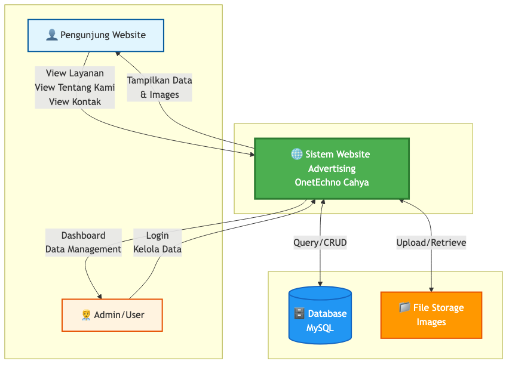
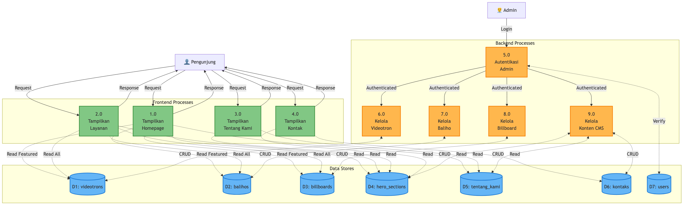
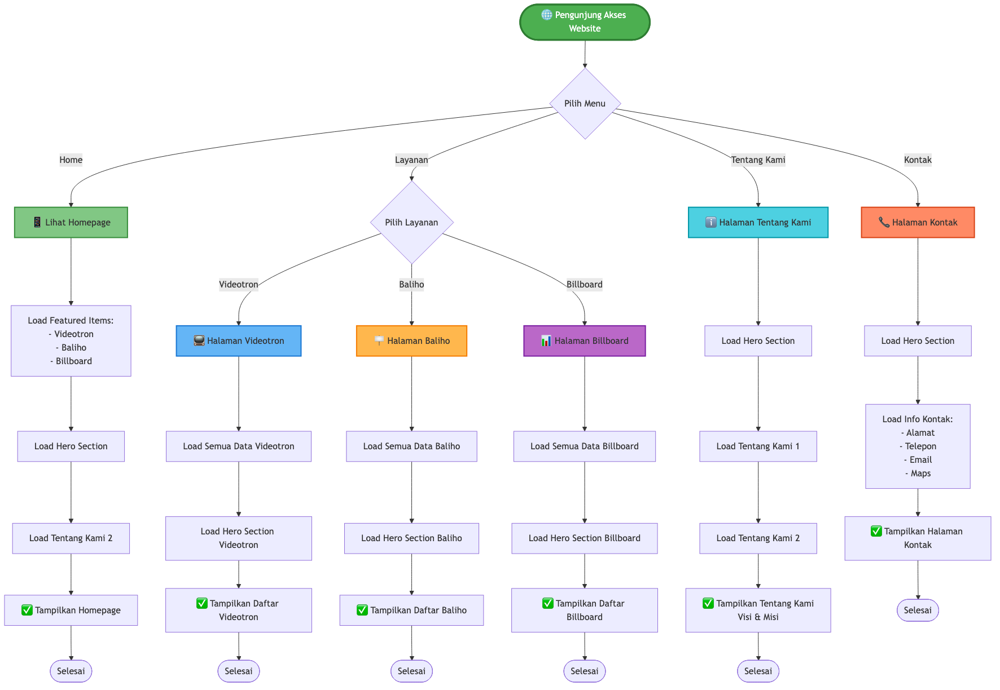
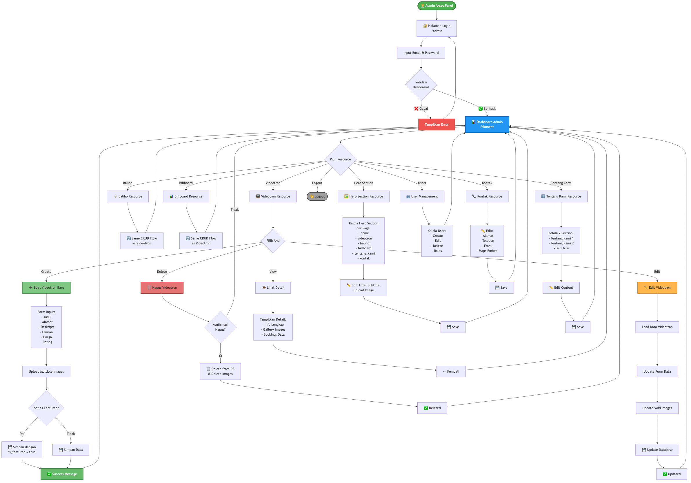
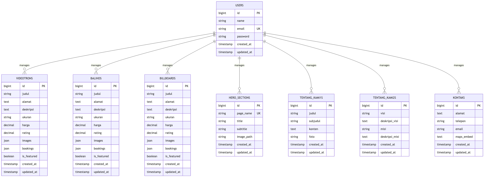

# 📊 DFD & Flowchart - Website Advertising OnetEchno

Folder ini berisi diagram-diagram alur sistem website advertising dalam format gambar PNG.

---

## 📁 Daftar Diagram

### 1. **01-context-diagram.png** (70KB)
**DFD Level 0 - Context Diagram**

Menggambarkan sistem secara keseluruhan dengan entitas eksternal (Pengunjung dan Admin) beserta interaksinya dengan sistem.



**Komponen:**
- 👤 Pengunjung Website
- 👨‍💼 Admin/User
- 🌐 Sistem Website Advertising OnetEchno Cahya
- 🗄️ Database MySQL
- 📁 File Storage (Images)

---

### 2. **02-level1-diagram.png** (226KB)
**DFD Level 1 - Proses Utama**

Menunjukkan proses-proses utama dalam sistem, baik frontend maupun backend, beserta aliran datanya.



**Frontend Processes:**
- 1.0 Tampilkan Homepage
- 2.0 Tampilkan Layanan
- 3.0 Tampilkan Tentang Kami
- 4.0 Tampilkan Kontak

**Backend Processes:**
- 5.0 Autentikasi Admin
- 6.0 Kelola Videotron
- 7.0 Kelola Baliho
- 8.0 Kelola Billboard
- 9.0 Kelola Konten CMS

**Data Stores:**
- D1: videotrons
- D2: balihos
- D3: billboards
- D4: hero_sections
- D5: tentang_kami
- D6: kontaks
- D7: users

---

### 3. **03-frontend-flowchart.png** (175KB)
**Flowchart - Frontend User Journey**

Alur perjalanan pengunjung website dari halaman ke halaman dengan detail proses loading data.



**Alur Utama:**
- Homepage → Load featured items + hero section
- Layanan → Videotron/Baliho/Billboard
- Tentang Kami → Visi & Misi
- Kontak → Info kontak & maps

---

### 4. **04-admin-flowchart.png** (316KB)
**Flowchart - Admin Management Flow**

Alur lengkap pengelolaan data oleh admin melalui panel Filament, termasuk CRUD operations.



**Fitur Admin:**
- 🔐 Login & Autentikasi
- ➕ Create (Tambah data baru)
- ✏️ Update (Edit data)
- 🗑️ Delete (Hapus data)
- 📤 Upload Multiple Images
- ⭐ Set Featured Items
- 👥 User Management

**Resources yang Dikelola:**
- Videotron Resource
- Baliho Resource
- Billboard Resource
- Hero Section Resource
- Tentang Kami Resource
- Kontak Resource
- User Management

---

### 5. **05-erd.png** (174KB)
**Entity Relationship Diagram**

Diagram relasi antar tabel dalam database dengan detail kolom dan tipe data.



**Tabel Database:**
- `users` - Admin user accounts
- `videotrons` - Data layanan videotron
- `balihos` - Data layanan baliho
- `billboards` - Data layanan billboard
- `hero_sections` - Hero section untuk setiap halaman
- `tentang_kami1s` - Section 1 tentang kami
- `tentang_kami2s` - Visi & Misi
- `kontaks` - Informasi kontak

**Relasi:**
- Users manages all content tables (1 to Many)

---

## 🎨 Keterangan Warna

### DFD & Flowchart:
- 🟢 **Hijau** = Frontend Processes / Success States
- 🟠 **Oranye** = Backend/Admin Processes
- 🔵 **Biru** = Data Stores/Database
- 🟣 **Ungu** = Special Resources
- 🟡 **Kuning** = Decision/Validation Points
- 🔴 **Merah** = Delete Operations / Errors

---

## 🛠️ Teknologi Stack

**Backend:**
- Laravel 11.x
- Filament 3.x (Admin Panel)
- MySQL Database

**Frontend:**
- Blade Templates
- Tailwind CSS
- Alpine.js (via Filament)

**Storage:**
- Laravel Storage System
- Symbolic Link: `public/storage` → `storage/app/public`

---

## 📝 Cara Regenerate Gambar

Jika perlu update diagram, edit file `.mmd` lalu jalankan:

```bash
# Install dependencies (one time only)
npm install --save-dev @mermaid-js/mermaid-cli

# Generate single diagram
npx mmdc -i diagrams/01-context-diagram.mmd -o diagrams/01-context-diagram.png -b transparent -w 2400

# Generate semua diagram sekaligus
npx mmdc -i diagrams/*.mmd -o diagrams/ -b transparent -w 2400
```

**Parameter:**
- `-i` = input file (.mmd)
- `-o` = output file (.png)
- `-b transparent` = background transparent
- `-w 2400` = width 2400px (high resolution)

---

## 📂 Struktur File

```
diagrams/
├── README.md                      # File ini
├── 01-context-diagram.mmd         # Source Mermaid
├── 01-context-diagram.png         # Gambar hasil
├── 02-level1-diagram.mmd
├── 02-level1-diagram.png
├── 03-frontend-flowchart.mmd
├── 03-frontend-flowchart.png
├── 04-admin-flowchart.mmd
├── 04-admin-flowchart.png
├── 05-erd.mmd
└── 05-erd.png
```

---

## 💡 Tips

1. **View di VS Code**: Gunakan Image Preview extension
2. **Edit Diagram**: Edit file `.mmd` lalu regenerate
3. **Export PDF**: Gunakan browser untuk print to PDF
4. **Presentasi**: Gambar sudah high-res, siap untuk presentasi

---

## 📞 Support

Untuk pertanyaan atau update diagram, hubungi tim development.

**Generated:** January 14, 2026
**Version:** 1.0
